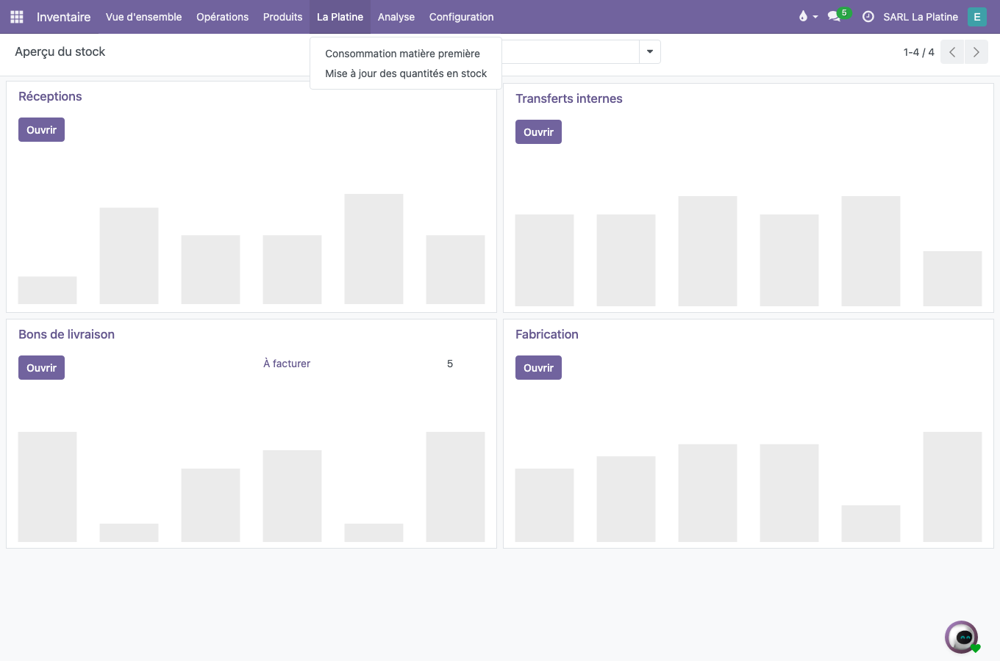
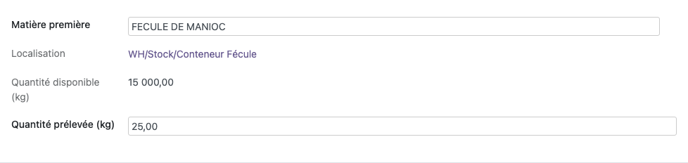
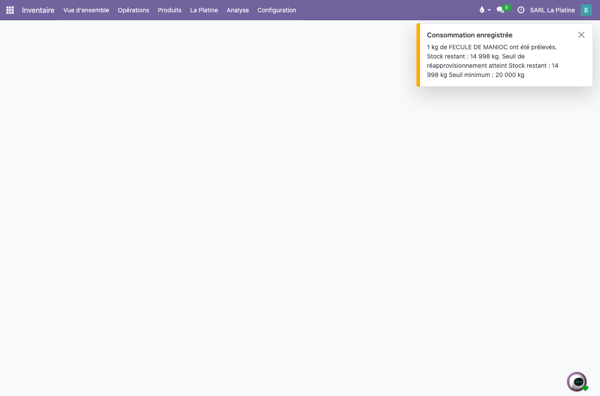
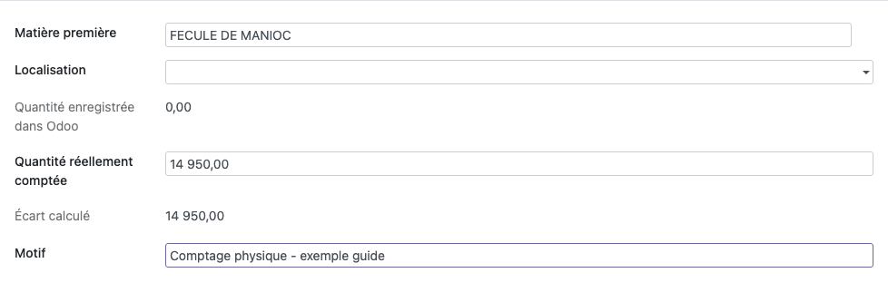
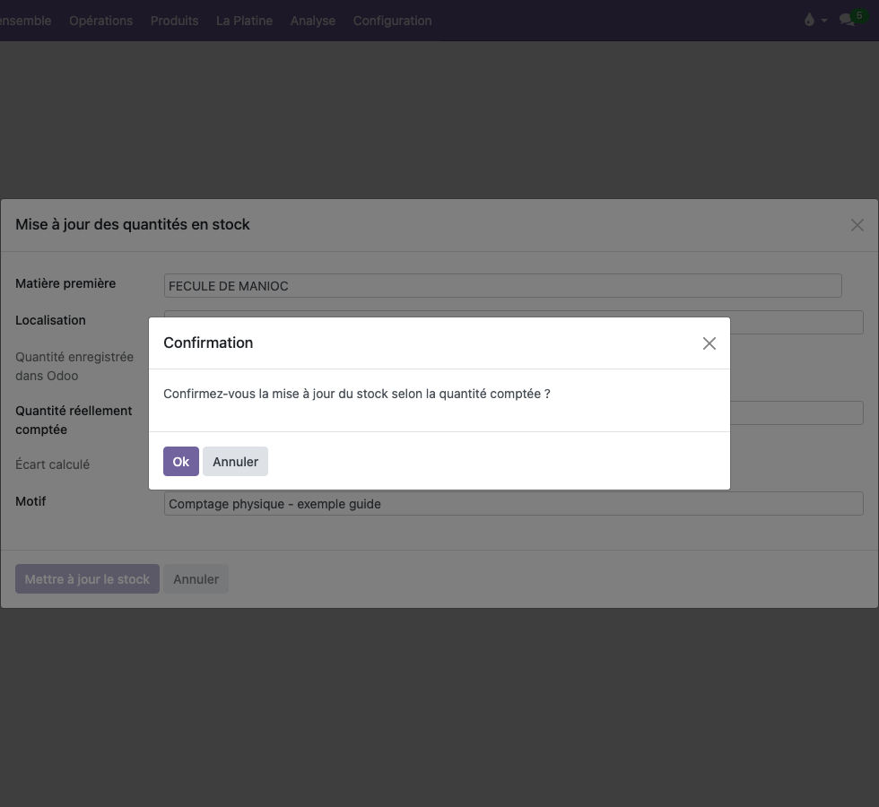
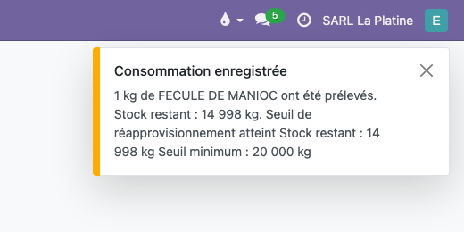

# Guide utilisateur — Fécule de manioc

**Pour Vérena et Ethel** — SARL La Platine  
**Référence** : `LAPLATINE-CONS-MP-USER-001` — juillet 2026

> **Version imprimable (PDF)** : [`GUIDE_UTILISATEUR_FECULE_VERENA_ETHEL.pdf`](GUIDE_UTILISATEUR_FECULE_VERENA_ETHEL.pdf)

---

## À retenir

| Situation | Action |
|-----------|--------|
| Je retire de la fécule pour produire | **Consommation matière première** |
| Je compte la fécule restante | **Mise à jour des quantités en stock** |
| Une alerte de stock minimum apparaît | Je termine l'enregistrement et je prends connaissance du niveau affiché |
| Je ne suis pas sûre de la quantité | **Annuler** avant de valider |

> **Je prélève = Consommation. Je compte = Mise à jour du stock.**

---

## Où trouver les deux fonctions ?

Dans le menu **Inventaire**, ouvrir **La Platine**. Deux choix sont disponibles :

1. **Consommation matière première** — quand vous retirez de la fécule pour la production ;
2. **Mise à jour des quantités en stock** — quand vous avez compté la fécule restante.



---

## 1. Consommation de fécule

### Quand utiliser cet écran ?

À chaque fois qu'une quantité de **fécule de manioc** est retirée du stock pour la production.

### Comment faire ?

**Inventaire → La Platine → Consommation matière première**

1. Choisir **FÉCULE DE MANIOC** dans la liste.
2. Vérifier l'**emplacement** proposé (ex. *WH/Stock/Conteneur Fécule*).
3. Lire la **Quantité disponible (kg)** affichée.
4. Saisir la **Quantité prélevée (kg)** — la quantité **retirée**, pas ce qu'il reste.
5. Cliquer sur **Enregistrer la consommation**.
6. Lire le message de confirmation (quantité prélevée et stock restant).



### Exemple

```text
Quantité disponible : 15 000,00 kg
Quantité prélevée :       25,00 kg
Stock restant :       14 975,00 kg
```



**Important** : la quantité saisie correspond à la fécule **retirée du stock**, pas à la quantité restante.

---

## 2. Mise à jour de la quantité en stock

### Quand utiliser cet écran ?

Après un **comptage physique**, si la quantité de fécule réellement présente est **différente** de celle affichée à l'écran.

### Comment faire ?

**Inventaire → La Platine → Mise à jour des quantités en stock**

1. Choisir **FÉCULE DE MANIOC**.
2. Vérifier l'**emplacement**.
3. Lire la **Quantité enregistrée dans Odoo**.
4. Saisir la **Quantité réellement comptée** — le **total présent après comptage**, pas l'écart.
5. Renseigner le **Motif** (ex. *Comptage du 05/07/2026*).
6. Cliquer sur **Mettre à jour le stock**.
7. Confirmer dans la fenêtre qui s'ouvre.



### Exemple

```text
Quantité enregistrée dans Odoo : 14 997,00 kg
Quantité réellement comptée :    14 950,00 kg
Écart calculé :                      -47,00 kg
```

**À saisir** : `14 950,00 kg` (la quantité comptée).  
**Ne pas saisir** : `-47,00 kg` (l'écart seul).



---

## 3. Alerte de stock minimum

Après **Enregistrer la consommation** ou **Mettre à jour le stock**, un message peut apparaître si le stock de fécule est **faible** par rapport au minimum défini.



Le message affiche notamment :

```text
Seuil de réapprovisionnement atteint
Stock restant : … kg
Seuil minimum : … kg
```

### Ce qu'il faut savoir

- L'alerte s'affiche **dans le message de confirmation** — pas besoin d'aller ailleurs.
- L'enregistrement **n'est pas bloqué** : l'opération est bien prise en compte.
- L'alerte vous informe que le niveau de fécule est **bas** par rapport au minimum.

---

## 4. En cas de doute

- **Quantité incertaine** → cliquer sur **Annuler** et recommencer après vérification.
- **Mauvais écran** → revenir au menu **La Platine** et choisir l'autre fonction (voir le tableau *À retenir*).

---

*Captures réalisées en production — profil opérateur Ethel — juillet 2026.*
